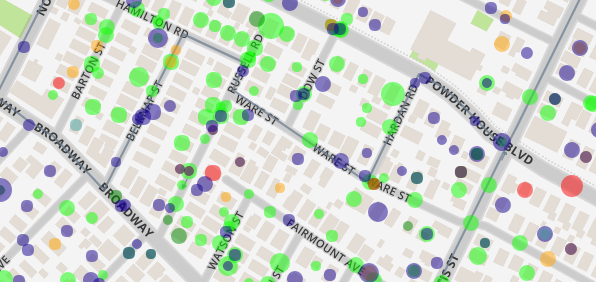

```{r setup, include=FALSE}
htmltools::tagList(rmarkdown::html_dependency_font_awesome())
```

# Who am I?

### Software developer <i class='fa fa-laptop'></i> / Data geek <i class='fa fa-database'></i> / Amateur mapper <i class='fa fa-map-o'></i>

### I love maps and data <i class='fa fa-heart-o'></i>

### [kentsjohnson.com](http://kentsjohnson.com)

### http://kentsj.com/Preso/Mapping_Civic_Data.html

???
Slippy maps are a great way to explore detailed geographic data.
---

# Who is voting for &lt;my candidate> ? 🗳

### My first slippy map, for Somerville Alderman elections, 2013

Map of canvassing data
`r emo::ji("footprints")` using Leaflet.js.
Shows location of supporters, non-supporters, not reached, etc.

Non-public data, sorry! `r emo::ji("man_facepalming")`


---

# Cambridge Open Data portal launch `r emo::ji("rocket")`

### 2015 - We have data...

Cambridge Vice Mayor Jan Devereux (then FPRA president) suggested that FPRA 
might need a “data person”. I volunteered. 🙌

Coincidentally, [Leaflet for R](http://rstudio.github.io/leaflet/) was 
released around the same time. 

.center[]

.center[]

### .center[`r emo::ji("cloud_with_lightning_and_rain")` `r emo::ji("zap")` A perfect storm `r emo::ji("zap")` `r emo::ji("cloud_with_lightning_and_rain")`]

???
FPRA is ?  
Ask who is familiar with Leaflet.   
Ask who is a programmer.  
What is R?  
---

# Let's explore! `r emo::ji("mag_right")`

--

<h3>How about some exploratory maps?</h3>

---

# Who owns Cambridge?

## 🏛 Institutional ownership of Cambridge property

- Based on assessor's data and parcel map (the first of many)
- Each parcel links to assessor's property page

### Issues

- Spelling - At least __7__ ways to spell  
  __`PRESIDENT & FELLOWS OF HARVARD COLLEGE`__
- Linking to property page via map-lot was problematic
- City staff were _very_ helpful with
  - understanding mysterious codes
  - updating the [Property Database](http://www.cambridgema.gov/propertydatabase/) website to support map-lot links

### [Town/Gown Map](http://kentsj.com/FPRA/TownGown.html)

???
Most of my Cambridge maps are mashups of assessor's data and the parcel map.  
Assessor's data has information about deeded properties  
Parcel map has locations  
Many-to-one relationship, e.g. many condos in a single parcel
---

# Where are the most valuable residential properties?

### An exploration of property values 💰

### [Top 100 Residential Properties map](http://kentsj.com/FPRA/Top100Residential.html)

- Updated for 2018 data, preserving the (crude) style
- Most field names changed from 2015 to 2018 `r emo::ji("slightly_frowning_face")`

---

# Seriously, now... `r emo::ji("thinking")`

--

<h3>It helps to have interesting questions.</h3>

???

Many of the following started with an email with the subject "Quick Question"
---

# Where is Cambridge Affordable Housing?

### An attempt to map all affordable housing in Cambridge

### Ultimately a failure `r emo::ji("woman_shrugging")`

- Many, many owners `r paste(sample(c(emo::ji_set('man')[1:20], emo::ji_set('man')[1:20]), 10), collapse=' ')`
- No centralized data source
- What counts as affordable, anyway?

### [Affordable Housing Map](http://kentsj.com/FPRA/AffordableHousing2.html)

???
Note Stamen toner.lite base map
---

# Who can create Accessory Housing? `r emo::ji("houses")`

### Combridge 2015 accessory housing ordinance was very restrictive.

### Limitations on lot size, building size, zone, etc.

#### How many properties might qualify for an accessory unit?

#### How could changes in the ordinance increase availability?

[Interactive application](http://kentsj.com/FPRA/AccessoryHousing.html)
made with [R](http://r-project.org) and [Shiny](http://shiny.rstudio.com) allows
exploration of eligible properties as the limitations
are changed.

Resulted in a change to the Cambridge zoning ordinance! `r emo::ji("tada")`

---

# Where are non-conforming lots?

### OK, where are lots with less than 20' frontage?

### .center[Twenty feet <i class='fa fa-long-arrow-right'></i>👣👣👣👣👣👣👣👣👣👣]

### Answering this required extensive geospatial processing.

- Buffer roads and sidewalks
- Split parcels into segments
- Segments fully in the buffer are frontage segments

The [map](http://kentsj.com/FPRA/SmallFrontage.html) itself is mostly confirmatory.

#### [Cambridge GIS](http://gis.cambridgema.gov) has _many_ useful datasets, yay!

---

# How will the Cambridge Lighting Ordinance affect me?

### Changes proposed to allowable outdoor lighting 💡 🚨 🏮

### Who is affected?

[Map](http://kentsj.com/LZ/ProposedLightingZones.html) based on existing zoning and proposed changes was used as part of a
campaign for a stronger ordinance.

Simple geospatial analysis to find areas of the zones and length of the border between zones.

---

# Who is building in the Alewife area?

### Alewife development has soared in the past ten years .

### 🏘 🏢 🏨 🏘 🏢 🏨 🏘 🏢 🏨 🏘 🏢 🏨 🏘 🏢 🏨

### There is no end in sight. &nbsp; <i class='fa fa-binoculars'></i>

[Alewife Development Map](http://kentsj.com/FPRA/Alewife_Projects.html) combines

- curated development information
- parcel map
- overlays for tree cover, parking, flood plain (please can we have open raster data?)

to shine light on development in this sensitive area.

---

# Alewife tax revenue? 💵

### Alewife development has not generated in a similar increase in revenue.

### Why not? `r emo::ji("man_shrugging")`

#### [Tax Revenue Report](http://kentsj.com/FPRA/AlewifeTaxRevenue.html) shows increase in valuation and taxes over six years.

Acquiring data for six years was difficult:

- Changing data format—different data, different names
- Missing data—residential exemption was supplied separately or not at all
- Mangled data—data in the wrong columns required fixup
- Auxiliary data—historical tax rates

---

# Where are SeeClickFix requests? 🔧

### [SeeClickFix](https://seeclickfix.com/cambridge) allows citizens to request services and report problems.

#### Original goal was to track tree planting requests. 🌳

#### Result is an [interactive app](http://kentsj.com/FPRA/SeeClickFix.html) showing stats on open and closed requests, and the location of open requests.

Data is pulled from the Open Data Portal as needed using the Socrata API.

---

# Do you want more?

--
<h3>Really?</h3>

---

# Do you want more?

### Really? &nbsp; OK 😁

#### [Cambridge Street Trees](http://kentsj.com/FPRA/Cambridge_Street_Trees.html)

#### [Cambridge Development Projects](http://kentsj.com/FPRA/Cambridge_Development_Projects.html)

#### [Building Permits](http://kentsj.com/FPRA/Building_Permits_2015-2017.html)

#### [Board of Zoning Appeals Requests](http://kentsj.com/FPRA/Board_of_Zoning_Appeal_Requests_CT.html)

---

# Why R?

[R](http://r-project.org) is a free software environment for statistical computing and graphics. It has

- Excellent data analysis
- Excellent static graphics
- Some interactive graphics
- Good geospatial support
- Easy integration with Leaflet
- Flexible, reproducible report generation with R Markdown
- A world-class IDE ([RStudio](https://www.rstudio.com/products/rstudio/))

.center[]

---

# .center[❓Questions❓]

### .center[[<i class='fa fa-envelope-o'></i> kent@kentsjohnson.com](mailto://kent@kentsjohnson.com)]

### .center[[kentsj.com/Preso/Mapping_Civic_Data.html](http://kentsj.com/Preso/Mapping_Civic_Data.html)]

### .center[[kentsj.com/Preso/Mapping_with_R.html](http://kentsj.com/Preso/Mapping_with_R.html)]

### .center[[<i class='fa fa-bitbucket'></i> bitbucket.org/kent37/fpra](https://bitbucket.org/kent37/fpra)]
